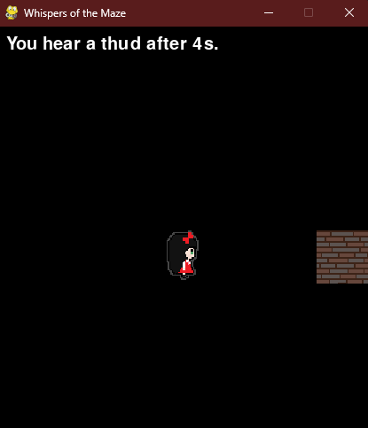
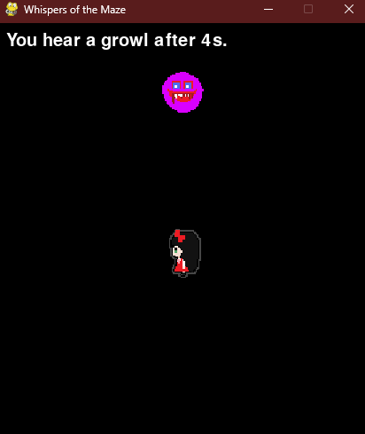
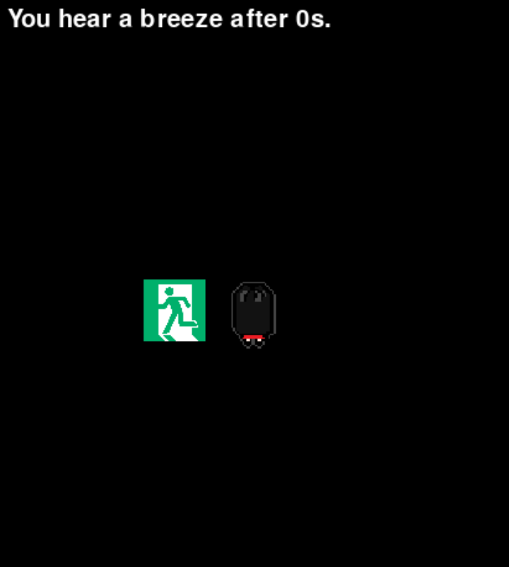
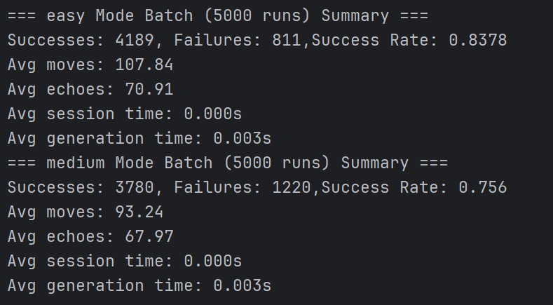
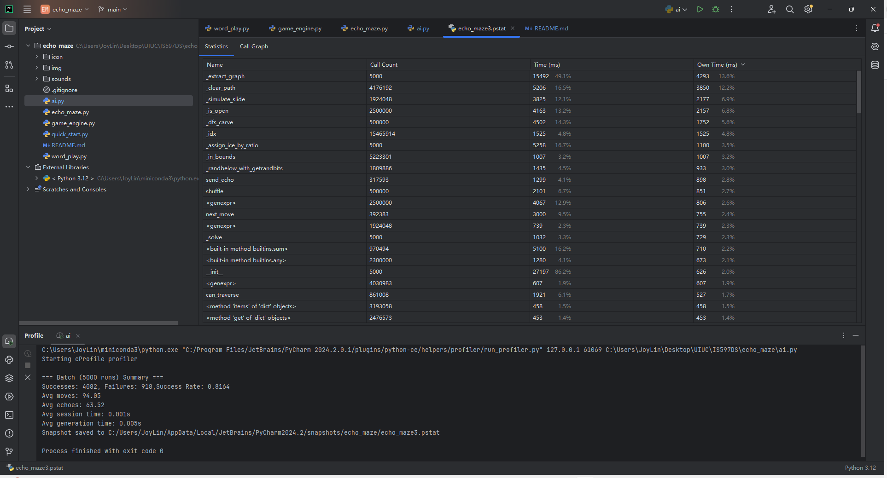

# Whispers of the Maze
### Team Member: Yueyue Lin, Peiyao Yang

## 1. Project Overview
Whispers of the Maze is a procedurally generated puzzle game where players navigate a hidden maze using only audio cues. Inspired by echolocation and logic puzzles, players explore the environment by emitting directional echoes that reveal what lies ahead—walls, monsters, or the goal.

The maze includes randomly placed monsters and ice corridors that challenge pathfinding with unpredictability and forced movement. The player starts blind, only able to see their current tile and the temporary results of echo scans, offering a tense and strategic experience.

---

## 2. Game Rules & Mechanics
### 🧱 Maze Generation
- Each game session begins with a **perfect maze**: connected and acyclic (i.e. exactly one unique path between any two points).
- Maze size: 10x10 grid.
- The algorithm ensures:
  - One unique path from start to exit.
  - Random placement of monsters (avoiding the solution path).
  - About 30% of long corridors become ice.

### 👁️ Blind Navigation
- The player sees **only their current cell**.
- All other cells are hidden until revealed via echo.
- 
### 🔊 Echo Detection (`W`, `A`, `S`, `D`)
- Echo travels **up to 3 cells** in a direction.
- Echo stops upon hitting:
  - **Wall** → plays *thud* sound + shows wall icon.
  - **Monster** → plays *growl* + shows monster icon.
  - **Exit** → plays *breeze* + shows exit icon.

### 🎮 Movement (Arrow Keys)
- The player moves **1 cell per arrow press** if no wall is present.
- If stepping on **ice**, the player will **slide until stopped** by a wall or non-ice floor.

### 💀 Monsters
- Hidden in the dark.
- Stepping on one = **instant game over**.
- 
### 🏁 Exit
- Reaching the exit = **you win**.
- 
---
## 3. Game Controls

| Action         | Key        |
|----------------|------------|
| Move Up        | ↑ (Arrow Up) |
| Move Down      | ↓ (Arrow Down) |
| Move Left      | ← (Arrow Left) |
| Move Right     | → (Arrow Right) |
| Echo Up        | `W`        |
| Echo Down      | `S`        |
| Echo Left      | `A`        |
| Echo Right     | `D`        |

---
## 4. Algorithm Analysis & Performance

### Maze Generation (DFS-based backtracking)
- The **base maze** is a fully connected, loop-free maze, generated using randomized depth-first search.
- In **medium**  difficulty, we add random extra paths after the base maze is built.
- Each cell is visited once (DFS), and additional edges are inserted with constant-time updates.
- **Time Complexity**:
  - Easy → O(N)
  - Medium → O(N + P), where P is the number of extra added paths (small, user-defined).

### Shortest Path Solver
- A breadth-first search (BFS) is used to ensure that the start and exit are connected and to identify the shortest path for testing purposes.
- **Time Complexity**: O(N + E), where N is the number of cells and E is the number of edges.
  - For a perfect maze, E ≈ N – 1 → Simplifies to **O(N)**.

### Echo Sound Logic
- For each echo request, the system checks at most 3 consecutive cells in a given direction.
- Early termination occurs upon detecting a wall, monster, or exit.
- **Time Complexity**: Constant-time per direction → **O(1)**.

### 🤖 AI Exploration (Testing Agent)

We developed a simple AI agent (`AISolver`) to automatically play and evaluate the game.  
The agent mimics human-like reasoning by sending echo signals (breeze, thud, growl) to inform its decisions.

#### Time & Space Complexity

- **Tremaux-based Exploration**:
  - The AI marks each edge as unvisited (0), visited once (1), or visited twice (2).
  - Each edge is traversed at most twice (once forward, once during backtracking).
  - **Worst-case Time Complexity**:
    - O(2E), where E is the number of maze edges.
    - For a perfect maze, E ≈ N – 1 → simplifies to **O(N)**.
    - For medium/hard modes (with extra P paths), total complexity becomes **O(N + P)**.
  - **Space Complexity**:
    - O(E), to track edge states and backtracking stack.

This makes the search more efficient compared to naive uninformed search.


#### 📊 Batch Testing Summary

We evaluated the system using the `run_batch()` function over 5,000 iterations:

These batch tests help verify:
✅ Maze solvability  
✅ Difficulty curve between modes  
✅ System performance and generation time

#### Profiler Results (cProfile + PyCharm visualization)
Based on the profiling data over 5000 runs:

The majority of runtime is spent in pre-processing (`_extract_graph`, `_clear_path`, `_simulate_slide`), especially for ice corridor logic.

### Insights
- The AI logic itself (`play`, `next_move`, `can_traverse`) is lightweight.
- The maze generation pipeline dominates runtime due to preprocessing ice paths and corridors.
- Echo checks are efficient (O(1)) and only affect a small portion of total runtime.


---
## 5. Technology Stack

- 🐍 Python 3.11+
- 🎮 `pygame` for real-time 2D rendering and audio
- 📁 Modular structure:
  - `echo_maze.py`: Maze generation, echo logic
  - `word_game.py`: CLI version
  - `pygame_game.py`: Main interactive game

---
## 6. How to Run

1. Install Python + `pygame`:
   ```bash
   pip install pygame
2. Run quick_start.py
    ```bash
   python quick_start.py
   
---
## 7. Future Improvements
1. The AI is still not intelligent enough and may fail to find the exit in some configurations.
2. Since the map is randomly generated, difficulty varies—sometimes paths are too straightforward without any monsters or forks. Adaptive difficulty scaling could help.
3. Add visual or auditory feedback for ice sliding duration.
4. Enable user-selectable maze size or difficulty presets.
5. Introduce limited-echo resource mode for increased challenge.
6. Add game state saving and replay system for better debugging or analysis
---
## Attribution & Copyright

- 🎨 **Graphics**: All pixel-art character and monster icons were **originally designed by the Yueyue Lin** and are not sourced from third-party repositories.
- 🔊 **Audio**: All background music and sound effects (thud, growl, breeze, etc.) are sourced from **royalty-free or open-license** collections and used in accordance with their terms.
- 🧠 **Codebase**: All code, including maze generation logic, echo simulation, and game engine, was written by the team members. No external codebases were copied. 

> 📜 This project and its source code are the intellectual property of the contributors listed. Redistribution or commercial use without permission is prohibited.
